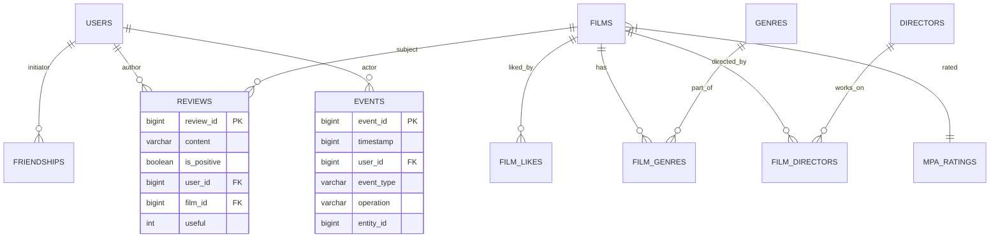

# Filmorate 🎬

**Filmorate** — это социальная сеть для любителей кино. Сервис позволяет оценивать фильмы, оставлять отзывы, добавлять друзей и следить за их активностью через ленту событий.

## 🛠 Стек технологий
* **Java 17** (Amazon Corretto)
* **Spring Boot 3.x** (Web, Validation, JDBC)
* **H2 Database** (In-memory)
* **Lombok**
* **Maven**

## 🚀 Основные возможности

### 🎞 Фильмы и Пользователи
* Стандартные CRUD операции, поиск и система рекомендаций.
* Режиссёры: добавление режиссёров к фильмам и вывод всех фильмов режиссёра с сортировкой по годам или лайкам.
* Система лайков для формирования рейтинга популярности.
* Управление списком друзей и удаление аккаунтов/фильмов.
* Вывод **популярных фильмов** с фильтрацией по жанру и году.

### 📝 Отзывы
* Пользователи могут оставлять отзывы на фильмы.
* Рейтинг полезности (`useful`) на основе лайков и дизлайков от других пользователей.
* Ограничение: один пользователь — один отзыв на конкретный фильм.

### 🔔 Лента событий
* Автоматическое логирование действий: друзья, лайки, отзывы.
* Просмотр ленты через эндпоинт `GET /users/{id}/feed`.
## 📊 Схема базы данных (ER-диаграмма)


## 👥 Команда проекта (Team)

*   **Константин (Team Lead)**
    *   Функциональность **«Отзывы»**.
    *   Функциональность **«Рекомендации»**.
*   **Яна**
    *   Функциональность **«Лента событий»**.
    *   Функциональность **«Удаление фильмов и пользователей»**.
*   **Сергей**
    *   Функциональность **«Поиск»**.
    *   Добавление **режиссёров** в фильмы.
*   **Павел**
    *   Вывод **популярных фильмов** по жанру и годам.
    *   Функциональность **«Общие фильмы»**.

## 🏗 Запуск проекта

1.  **Сборка проекта:**
    ```bash
    mvn clean install
    ```
2.  **Запуск приложения:**
    ```bash
    mvn spring-boot:run
    ```
3.  **Доступ к API:**
    Приложение будет доступно по адресу: [http://localhost:8080](http://localhost:8080)

---
*Проект выполнен в рамках группового задания курса Java-разработчик (Яндекс Практикум).*

